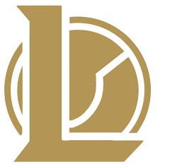

  

# What is League of Legends Bot

  * League of legends bot is a pixel bot for League Of Legends 10.8, written in C# .NET using image processing (image & text recognition), Interop and Lua scriptting.
  * This software is opensource and free.
  * It's a good way to raise your account level 30 without having to play or simply to win blue essences.

  > Version: League of Legends 10.8

  [

](https://discord.gg/cB8qtcE)

  

## Installation

   Requirements :
   * League Of Legends client
   * a League of legends account
   * a monitor with a **1920 * 1080** screen resolution.
   * .NET framework 4.7 installed on computer.

   Before launch the bot, you need to follow setup instructions bellow : 

   ### [Setup instructions](https://github.com/Skinz3/League-Of-Legends-BOT/wiki/How-to-make-it-work)

  
	 
# Contact

   Join the discord server : 

# LeagueBot Wiki

   FAQ, Api documentation... some good stuff :wink:

   [Here is the wiki](https://github.com/Skinz3/League-Of-Legends-BOT/wiki) 

# Authors

   * **Skinz** - *Initial work* [Skinz3](https://github.com/Skinz3)
   * **Forerunner**  [Glenndilen](https://github.com/glenndilen)
