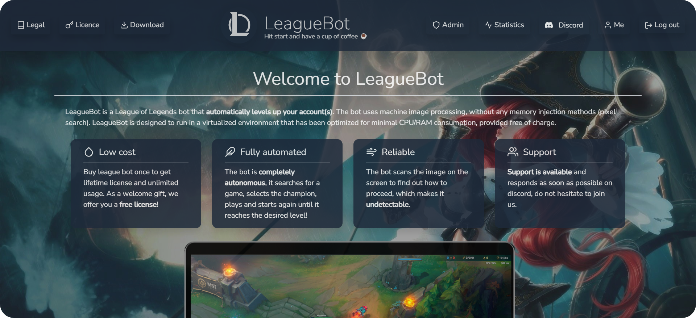

 

 <h1> Download 🚀: https://league-bot.com</h1>
<h1>🥰 <a href="https://discord.gg/bShwkmAaZd" >Join us on discord  </a></h1>
  

  
  

# Welcome to LeagueBot. 

<h1>This project is deprecated. join https://league-bot.com to get the new version </h1>

  * League of legends bot is a pixel bot for League Of Legends 10.19, written in C# .NET using image processing (image & text recognition), Interop and scriptting engine.
  * This software is opensource and free feel free to create a pull request!
  * It's a good way to raise your account level 30 without having to play or simply to win blue essences.

  > Version: League of Legends 10.19

  This product is used to work with other program/service (League of Legends) so you take full responsibility for breaking their Terms of Service and full responsibility for the accounts that you’re using with this bot and agree to use it at your own risk.

# Current Features
  * Start a Coop Game
  * Follow the strongest Ally
  * Cast spells on champions and minions
  * Back and buy items when weak
  * End game, earn experience
  * Loop 👨‍🌾🐿️
  
## Installation

   Requirements :
   * Actual League Of Legends client
   * A League of legends account
   * A monitor with a **1920 * 1080** screen resolution.
   * .NET framework 4.7 installed on computer.

# Author

   * **Skinz** - https://github.com/Skinz3

# Special Thanks

   * **Arecki** - For his help with LCU Api.
